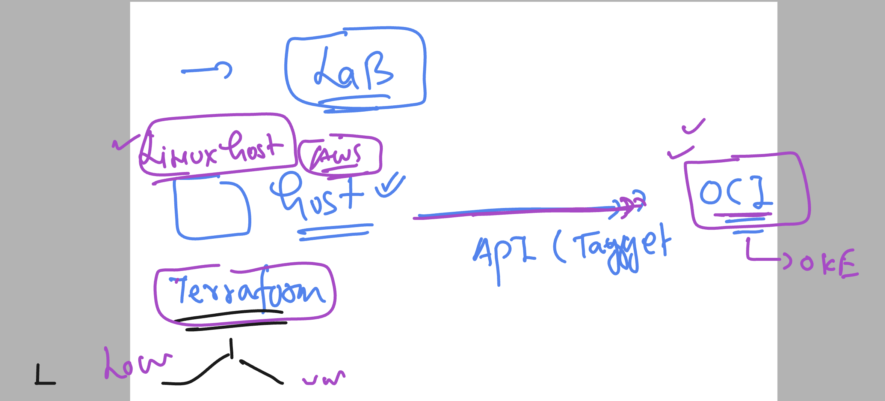
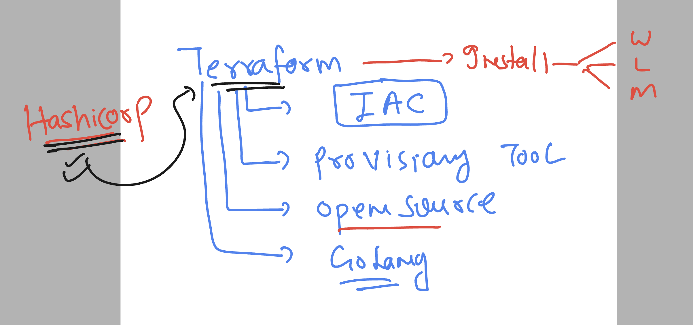

# oke_vodafone_terraform

### Understanding lab connection 



### Introduction to terraform basic 



### Terraform installation on linux host (amazonlinux)

```
sudo yum install -y yum-utils shadow-utils
sudo yum-config-manager --add-repo https://rpm.releases.hashicorp.com/AmazonLinux/hashicorp.repo
sudo yum -y install terraform
```

### installation link 

[click_here](https://developer.hashicorp.com/terraform/install)

### terraform version verify 

```
 terraform version
Terraform v1.6.4
on linux_amd64
```
